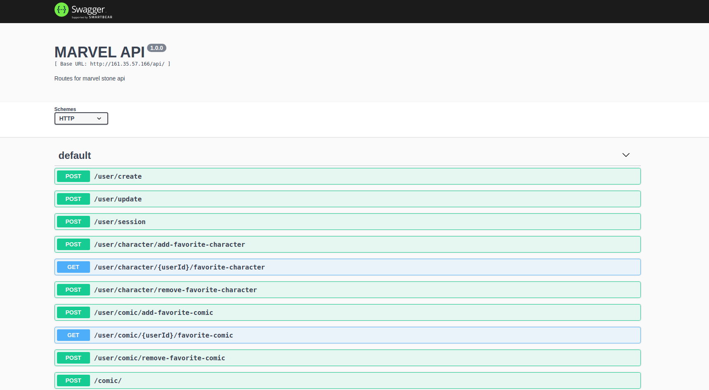
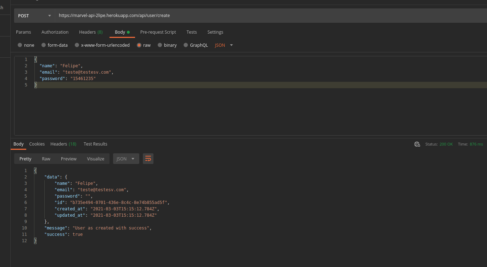
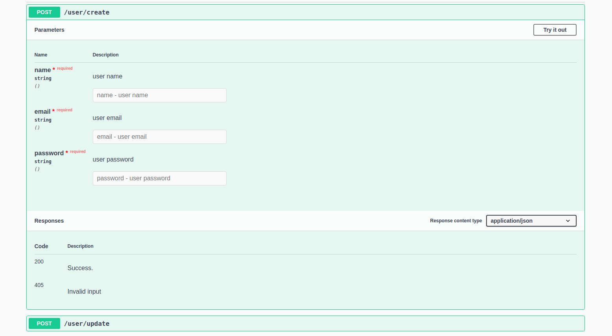

<h3 align="center">
  Marvel Api
</h3>

<br>

<p align="center">Este projeto se propós a realizar a criação de uma API com o intuito de cosumir dados da API Marvel, realizar autenticação de usuário e disponibilizar dados de Comics e Characters para o usuário. Api feita utilizando NodeJS com DDD patterns</p>

# Documentação da API

[Swagger](https://marvel-api-2lipe.herokuapp.com/swagger/)

<br>

### 🛠 Tecnologias

As seguintes ferramentas foram usadas na construção do projeto:

- [Nodejs](https://nodejs.org/en/)
- [Docker](https://www.docker.com/)
- [TypeORM](https://github.com/typeorm/typeorm#readme)
- [Postgres](https://github.com/postgres/postgres)
- [Express](https://github.com/expressjs/express)
- [Jest](https://github.com/facebook/jest)
- [Sqlite3](https://github.com/mapbox/node-sqlite3)

<br>

# :coffee: Demonstrações

<div>
  <p align="center">
    
    
    
  </p>
</div>

Após clonar o repositório, entre na pasta `marvel-api` e instale todas as dependências utilizando o comando:

```bash
# Digite o comando abaixo para instalar as dependências:
yarn install

ou

npm install
```

Irá precisar criar um container no Docker: <br> `docker run --name postgresql-container -p 5432:5432 -e POSTGRES_PASSWORD=somePassword -d postgres`.

Criar um banco de dados - `marvelDEV`

Após instalar as dependências e criar o banco no Docker, rode as migrations: `yarn run-scheme:dev` ou `npm run run-scheme:dev`.

Depois rode a aplicação - `npm run dev` or `yarn dev`.

### Autor

---

<div align="center">
<a href="https://2lipe.netlify.app/" target="_blank">
 
 <br />
 <sub><b>Felipe Vieira</b></sub></a> <a href="https://2lipe.netlify.app/" target="_blank" title="Felipe Vieira"></a>

Made by Felipe Vieira

</div>
